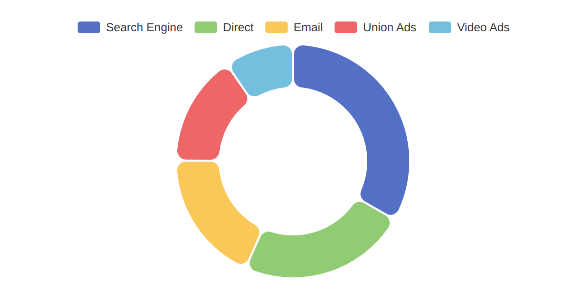

# node-echarts



Generate chart images using command line or Node.js API. No need to create a website!

Note: you must have internet access when using this tool, because it loads JS from CDN.

## Install

```bash
npm i node-echarts
```

## CLI

```bash
echarts --input option.json --output chart.png --width 400 --height 300 --dpr 2
```

## API

```js
import { outputChartImage } from 'node-echarts';

const option = {};

outputChartImage('output.png', option, { width: 400, height: 300, dpr: 2 });
```

## Options

### width

Width of chart in pixel. Default `400`.

### height

Height of chart in pixel. Default `300`.

### dpr

Device pixel rate. Default `1`.
